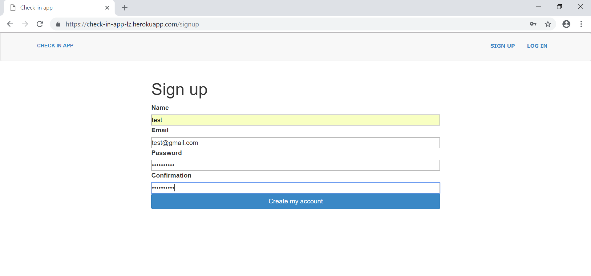
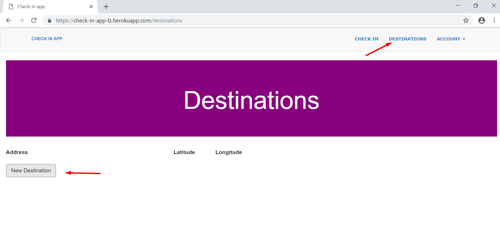
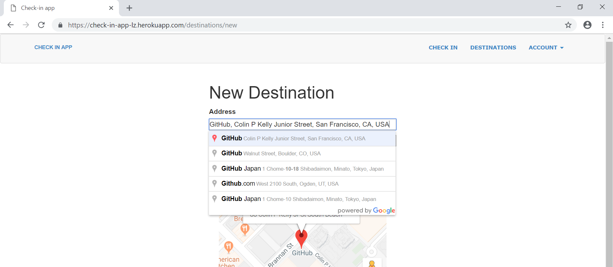
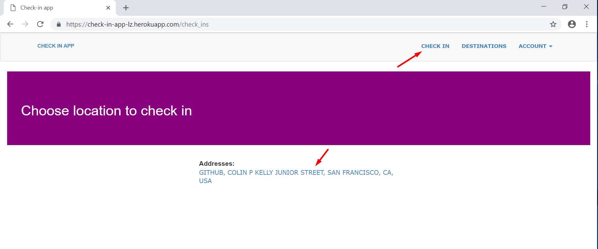
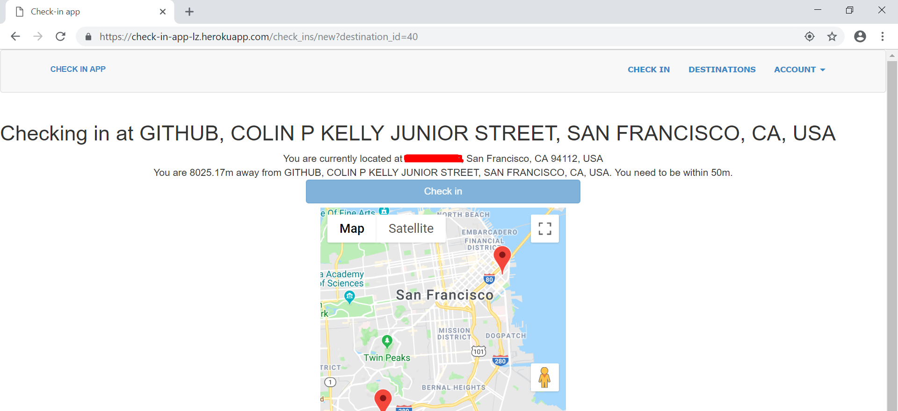

# Introduction
Check in is an app that allows for users to check in once they've reached their destination.

## Installation
* You can check this app out on [Heroku](https://check-in-app-lz.herokuapp.com/)

## Description
* User can create destinations to check in at.
* The geocoder gem is used to convert the address to longitute and latitude.
* In order to check in, user must be within 50 meters of the location.
* This app uses the geolocation track the longitude and latitude of the user. 
* It uses the google maps API to geocode the address for display.
* If using on phone, access webpage using https, and turn on geolocation.

## Usage
* You must first register for an account to create destination locations and check in.

* Then create a destination to check in at.

* After you have created a destination, click on the Check In link.

* if you are within 50 meters of the destination, the check in button turns dark blue you may check in. If you are not within 50 meters, you will not be allowed to check in.
